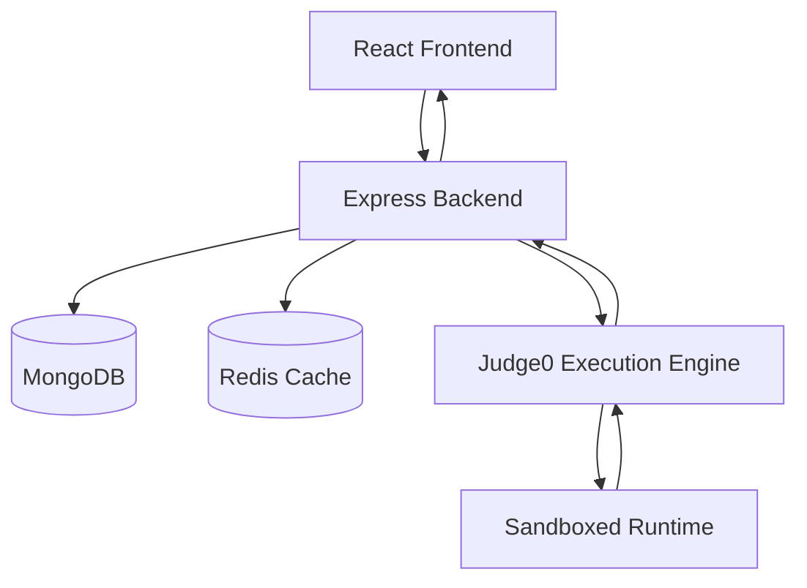

# Copilot LeetCode Engine 🚀

A full-stack online judge platform inspired by LeetCode, built to create, solve, evaluate, and manage algorithmic coding challenges. The platform features secure authentication, real-time code execution, automated test-case evaluation, and an admin dashboard for problem management.

## Overview

Nexus LeetCode Engine provides an end-to-end coding interview practice experience. Users can solve problems in multiple programming languages, execute code against sample test cases, and submit solutions for evaluation against hidden test suites. Administrators can create and manage coding challenges through a dedicated interface.

## Key Features

### Authentication & Security


* JWT-based authentication using secure HTTP-only cookies
* Password hashing with bcrypt
* Protected routes and role-based authorization
* Secure backend validation and middleware architecture

### Online Judge System

* Multi-language code execution support
* Real-time code compilation and testing
* Judge0-powered sandboxed execution environment
* Hidden and visible test case evaluation
* Runtime and memory usage analysis

### Problem Management

* Create, update, and manage coding challenges
* Difficulty levels (Easy, Medium, Hard)
* Tag-based categorization
* Starter code templates
* Custom test case management

### Submission Tracking

* Run code against sample test cases
* Submit solutions for final evaluation
* Store submission history
* Track solved problems and user progress
* Optimized query performance using MongoDB indexing

### Performance Optimization

* Redis-powered caching layer
* Efficient database schema design
* Batch execution handling through Judge0
* Optimized API architecture for scalability

---

## System Architecture



---

## Tech Stack

### Frontend

* React 19
* Vite
* React Router v7
* Redux Toolkit
* React Hook Form
* Zod
* Axios
* Tailwind CSS v4
* DaisyUI

### Backend

* Node.js
* Express.js
* MongoDB
* Mongoose
* Redis
* JWT Authentication
* bcrypt
* Cookie Parser
* CORS

### Code Execution

* Judge0 API

---

## API Modules

### User Authentication

| Method | Endpoint        |
| ------ | --------------- |
| POST   | `/user/signup`  |
| POST   | `/user/login`   |
| POST   | `/user/logout`  |
| GET    | `/user/profile` |

### Problems

| Method | Endpoint          |
| ------ | ----------------- |
| GET    | `/problem/all`    |
| GET    | `/problem/:id`    |
| POST   | `/problem/create` |

### Submissions

| Method | Endpoint                 |
| ------ | ------------------------ |
| POST   | `/submission/run/:id`    |
| POST   | `/submission/submit/:id` |

---

## Local Development Setup

### Prerequisites

* Node.js 18+
* MongoDB
* Redis
* Judge0 API Credentials

### Clone Repository

```bash
git clone https://github.com/codernihal2006/Leet-Code.git
cd Leet-Code
```

### Backend Setup

```bash
cd backend
npm install
```

Create a `.env` file:

```env
PORT=5000
MONGO_URI=YOUR_MONGODB_URI
REDIS_URL=YOUR_REDIS_URL
JWT_SECRET=YOUR_JWT_SECRET
JUDGE0_API_KEY=YOUR_JUDGE0_API_KEY
JUDGE0_HOST=YOUR_JUDGE0_HOST
```

Start backend:

```bash
npm start
```

### Frontend Setup

```bash
cd frontend
npm install
npm run dev
```

Open:

```text
http://localhost:5173
```

---

## Future Enhancements

* Contest Mode
* Leaderboards & Rankings
* Discussion Forums
* AI-Powered Solution Hints
* Code Playback & Submission Replay
* Docker-Based Self-Hosted Judge Infrastructure

---

## Author

**Nihal**

Built to explore scalable system design, secure authentication, distributed code execution workflows, and modern full-stack development practices.
